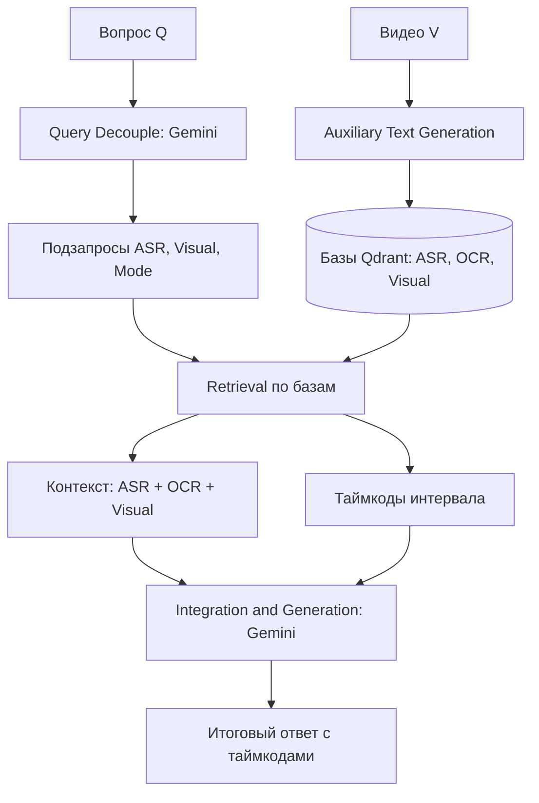

# Multimodal Video Search (Video-RAG)

Универсальная система мультимодального семантического поиска и генеративного ответа (Video-RAG) по видеоконтенту.

[](#7-интерфейс-mvp)
[-blue)](#8-результаты-и-метрики)
[](#9-происхождение-проекта-и-вклад)

---

## 1. Решаемая проблема
Обычный поиск по видеофайлам ограничен их текстовыми метаданными (названием, описанием, тегами). Проект реализует **внутрикадровый семантический поиск** по трем дополняющим друг друга модальностям:
- **Речь спикера (ASR)**: Распознавание аудиодорожки.
- **Текст в кадре (OCR)**: Распознавание слайдов, кода, титров.
- **Визуальные описания (Visual)**: Описание объектов и действий на сцене.

Система локализует точный временной интервал (таймкод) и генерирует обоснованный текстовый ответ на основе извлеченного контекста.

## 2. Области применения
- **Образование**: Поиск нужного фрагмента лекции или вебинара по терминам, формулам или коду на слайдах.
- **Медиа и стриминг**: Семантическая навигация по каталогам видеоматериалов.
- **Бизнес-аналитика**: Быстрый поиск упоминаний брендов, демонстраций продуктов или конкретных сцен в архивах записей.

## 3. Архитектура системы
Пайплайн базируется на трех этапах архитектуры **Video-RAG (arXiv:2411.13093)**:
1. **Query Decouple**: Модель класса LLM/VLM (Gemini 3.5 Flash) преобразует вопрос пользователя в структурированные подзапросы для речи (ASR) и визуальных объектов (Visual).
2. **Auxiliary Text Retrieval**:
   - **ASR**: Речь извлекается с помощью модели Whisper.
   - **OCR**: Текст с кадров считывается через EasyOCR с шагом 5 секунд.
   - **Visual**: Кадры описываются моделью BLIP, затем spaCy разбирает их на scene graph сущности.
   - Мультимодальный контекст векторизуется моделью `Qwen3-Embedding-0.6B` и сохраняется в векторной базе `Qdrant`.
3. **Integration & Generation**: Найденные текстовые ASR/OCR/Visual-контексты и исходный вопрос объединяются и передаются в Gemini для генерации ответа с таймкодами.



## 4. Быстрый запуск

### Установка зависимостей:
```bash
python -m venv .venv
source .venv/bin/activate
pip install -r requirements.txt
python -m spacy download en_core_web_sm
```

### Настройка переменных окружения (`.env`):
Создайте файл `.env` на основе примера `.env.example`:
```env
EMBEDDING_BACKEND=local
GOOGLE_API_KEYS=your_gemini_api_key
```

### Запуск веб-интерфейса:
```bash
uvicorn app:app --reload
```
Интерфейс будет доступен по адресу `http://127.0.0.1:8000`.

## 5. Запуск оценки (Benchmark)
Для оценки качества поиска (ASR-only против Multimodal) на подготовленном датасете из 31 видеофайла выполните:
```bash
python scripts/run_benchmark.py
```
Результаты будут сохранены в файл `benchmark_results.md`.

*Примечание: Полное воспроизведение опубликованных метрик требует локального демонстрационного набора и подготовленных индексов, которые не распространяются в публичном репозитории из-за отсутствия прав на исходные видео.*

## 6. Докер-окружение (Экспериментально)
Сборка контейнера:
```bash
docker build -t multimodal-video-search .
```
Запуск:
```bash
docker run -p 8000:8000 --env-file .env multimodal-video-search
```

## 7. Интерфейс MVP
Веб-интерфейс позволяет загружать новые видеофайлы через drag-and-drop, отслеживать логи фоновой индексации в реальном времени (через SSE) и выполнять семантические запросы с автоматической прокруткой плеера на найденный таймкод.

## 8. Результаты и метрики
- **ASR-only**: Hit@1 = 70.00%, Hit@3 = 80.00%
- **Multimodal (Max-per-Modality)**: Hit@1 = **80.00%**, Hit@3 = **100.00%** (на текущем development-наборе с замороженной декомпозицией запросов Max-per-Modality улучшил Hit@3 на один запрос; результат предварительный и требует проверки на независимой тестовой выборке)
- **Multimodal (RRF слияние)**: Hit@1 = 80.00%, Hit@3 = 90.00% (улучшает Sum по Hit@1, но не достигает baseline)
- **Multimodal (Sum слияние)**: Hit@1 = 70.00%, Hit@3 = 90.00%
*Подробный разбор эксперимента приведен в файле `benchmark_results.md`.*

## 9. Происхождение проекта и вклад
Проект вырос из исследовательской репликации архитектуры Video-RAG и последующей разработки прототипа.

- **Разработка универсального пайплайна, интеграция ASR/OCR/Visual, Qdrant retrieval/fusion (RRF, Max-per-Modality), API/UI, очистка от прототипного кода, benchmark**: Максим Ляра.
- **Теоретический разбор исходной статьи, подготовка начального тестового датасета**: Одногруппница (студентка программы "Цифровая экономика" РАНХиГС).
- **Исследование доменной специфики данных на этапе прототипа**: Команда прототипирования.

Подробная информация о вкладе участников представлена в [CONTRIBUTORS.md](CONTRIBUTORS.md), история эволюции проекта — в [PROJECT_HISTORY.md](PROJECT_HISTORY.md).

## 10. Ссылки и цитирование
- **Исходная статья**: [Video-RAG: Visually-aligned Retrieval-Augmented Long Video Comprehension (arXiv:2411.13093)](https://arxiv.org/abs/2411.13093)
- **Официальный репозиторий Video-RAG**: [Leon1207/Video-RAG-master](https://github.com/Leon1207/Video-RAG-master)
- **Архивный исследовательский репозиторий**: [maxlyara1/video-rag-research](https://github.com/maxlyara1/video-rag-research)
