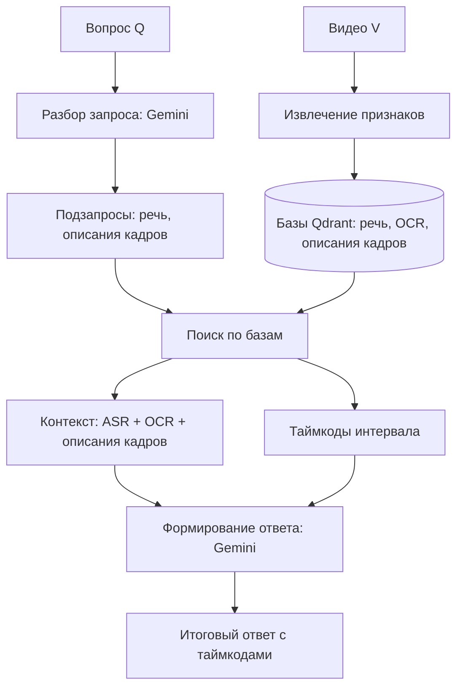

# Multimodal Video Search (Video-RAG)

Универсальная система мультимодального семантического поиска и генеративного ответа (Video-RAG) по видеоконтенту.

[](#7-демонстрационное-приложение)
[](#9-происхождение-проекта-и-вклад)

---

## 1. Решаемая проблема
Обычный поиск по видеофайлам ограничен их текстовыми метаданными (названием, описанием, тегами). Проект реализует **семантический поиск по содержимому видео** по трем дополняющим друг друга источникам информации:
- **Речь спикера (ASR)**: Распознавание аудиодорожки.
- **Текст в кадре (OCR)**: Распознавание слайдов, кода, титров.
- **Визуальные описания**: Описание объектов и действий на сцене (описания кадров).

Система возвращает релевантные временные интервалы-кандидаты и генерирует обоснованный текстовый ответ на основе извлеченного контекста.

## 2. Области применения
- **Образование**: Поиск нужного фрагмента лекции или вебинара по терминам, формулам или коду на слайдах.
- **Медиа и стриминг**: Семантическая навигация по каталогам видеоматериалов.
- **Бизнес-аналитика**: Быстрый поиск упоминаний брендов, демонстраций продуктов или конкретных сцен в архивах записей.

## 3. Архитектура системы
Конвейер обработки базируется на трех этапах архитектуры **Video-RAG (arXiv:2411.13093)**:
1. **Разбор запроса**: Языковая модель Gemini разбирает вопрос на запросы по речи и описаниям кадров.
2. **Поиск по извлечённым текстам**:
   - **ASR**: Речь извлекается с помощью модели Whisper.
   - **OCR**: Текст с кадров считывается через EasyOCR с шагом 5 секунд.
   - **Описания кадров**: Кадры описываются моделью BLIP, после чего библиотека spaCy выделяет упомянутые объекты и простые синтаксические связи между ними.
   - Текстовый контекст векторизуется моделью `Qwen3-Embedding-0.6B` и сохраняется в векторной базе `Qdrant`.
3. **Подготовка контекста и ответа**: Найденные контексты из речи (ASR), текста в кадре (OCR) и описаний кадров объединяются с исходным вопросом и передаются в Gemini для генерации ответа с таймкодами.



## 4. Быстрый запуск

### Установка зависимостей:
```bash
python -m venv .venv
source .venv/bin/activate
pip install -r requirements.txt
python -m spacy download en_core_web_sm
```

### Настройка переменных окружения (`.env`):
Создайте файл `.env` на основе примера `.env.example`:
```env
EMBEDDING_BACKEND=local
GOOGLE_API_KEYS=your_gemini_api_key
```

### Запуск веб-интерфейса:
```bash
uvicorn app:app --reload
```
Интерфейс будет доступен по адресу `http://127.0.0.1:8000`.

## 5. Оценка качества
Исходные видеофайлы не публикуются в репозитории в целях соблюдения авторских прав. Оценка качества и воспроизведение метрик выполняются на основе извлеченных текстовых JSON-артефактов, содержащих распознанную речь, текст на экране и описания кадров.

### Восстановление векторного индекса из артефактов:
Перед запуском оценки необходимо восстановить базу векторов Qdrant из JSON-артефактов:
```bash
PYTHONPATH=. EMBEDDING_BACKEND=local python scripts/reindex_from_artifacts.py
```
Этот скрипт проверит целостность набора данных (соответствие манифеста `dataset_manifest.json` и файлов в `data/artifacts/`), автоматически векторизует тексты моделью `Qwen3-Embedding-0.6B` и создаст коллекции в Qdrant.

### Запуск оценки:
После успешного восстановления индекса запустите скрипт оценки:
```bash
PYTHONPATH=. EMBEDDING_BACKEND=local python scripts/run_benchmark.py
```
Результаты оценки будут сохранены в файл `benchmark_results.md`.

## 6. Докер-окружение (Экспериментально)
Сборка контейнера:
```bash
docker build -t multimodal-video-search .
```
Запуск:
```bash
docker run -p 8000:8000 --env-file .env multimodal-video-search
```

## 7. Демонстрационное приложение
Веб-интерфейс позволяет загружать новые видеофайлы через перетаскивание файлов, отслеживать логи фоновой обработки в реальном времени (через SSE) и выполнять семантические запросы с автоматической прокруткой плеера на найденный таймкод.

## 8. Результаты и метрики
- **Только ASR (Базовый вариант)**: Hit@1 = 66.00%, Hit@3 = 80.00%
- **Мультимодальный поиск (Max-per-Modality)**: Hit@1 = **90.00%**, Hit@3 = **96.00%** (на проверочном наборе из 50 запросов с зафиксированной декомпозицией выбор активных модальностей совместно с методом Max-per-Modality повысил Hit@1 на 24 процентных пункта относительно базового варианта)
- **Мультимодальный поиск (RRF)**: Hit@1 = 88.00%, Hit@3 = 94.00%
- **Мультимодальный поиск (простая сумма)**: Hit@1 = 70.00%, Hit@3 = 94.00%
*Подробный разбор эксперимента приведен в файле `benchmark_results.md`.*

## 9. Происхождение проекта и вклад
Первоначальный прототип был создан в рамках совместного хакатона ИТМО × ЦУ («ИИ Чемп 2026») для кейса Okko. После хакатона проект был индивидуально переработан и расширен до универсальной исследовательской системы.

- **Личный вклад**: Постановка задачи, проектирование архитектуры, выбор моделей, подготовка эксперимента, оценка результатов и итоговая интеграция системы. При написании кода, интерфейса, тестов и документации в качестве вспомогательных инструментов разработки использовались ИИ-агенты.
- **Теоретический разбор статьи и видеоматериалы**: Одногруппница по программе «Цифровая экономика» РАНХиГС участвовала в разборе научной статьи Video-RAG и подготовке первичных видеоматериалов.
- **Исходное прототипирование**: Командная база совместного хакатона ИТМО × ЦУ.

Подробная информация о вкладе участников представлена в [CONTRIBUTORS.md](CONTRIBUTORS.md), история эволюции проекта — в [PROJECT_HISTORY.md](PROJECT_HISTORY.md).
